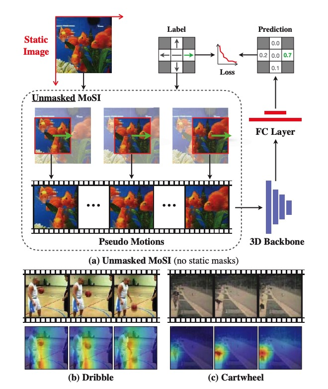

# Self-supervised Motion Learning from Static Images (CVPR 2021)
[Ziyuan Huang](https://huang-ziyuan.github.io/), [Shiwei Zhang](https://www.researchgate.net/profile/Shiwei-Zhang-14), Jianwen Jiang, Mingqian Tang,
[Rong Jin](https://www.cse.msu.edu/~rongjin/), [Marcelo Ang](https://www.eng.nus.edu.sg/me/staff/ang-jr-marcelo-h/), <br/>
In CVPR, 2021. [[Paper]](https://openaccess.thecvf.com/content/CVPR2021/papers/Huang_Self-Supervised_Motion_Learning_From_Static_Images_CVPR_2021_paper.pdf).


## Introduction

This work proposes MoSI, a simple framework for the video models to learn motion representations from images. It is
shown that MoSI can discover and attend to prominent motions in videos, thus yielding a strong representation for the
downstream action recognition task.



## Example usage

#### Usage

* Run

```
cd $REPO_ROOT_DIR
# We recommend run pretrain with 16 V100 cards, and fintune with 8 V100 cards.
# Pretrain ResNet3D-R2D3DBranch on Hmdb51 dataset
CUDA_VISIBLE_DEVICES=0,1,2,3,4,5,6,7 python -m torch.distributed.launch --nproc_per_node=8 tools/train.py \
    --ext_module papers/CVPR2021-MOSI/impls --config config/MoSI_r2d3d_hmdb.py --dist_launcher pytorch
# Finetune ResNet3D-R2D3DBranch on Hmdb51 dataset
CUDA_VISIBLE_DEVICES=0,1,2,3,4,5,6,7 python -m torch.distributed.launch --nproc_per_node=8 tools/train.py \
    --ext_module papers/CVPR2021-MOSI/impls --config config/Finetunue_r2d3d_hmdb.py --dist_launcher pytorch
```

## Citing MoSI
If you find MoSI useful for your research, please consider citing the paper as follows:
```BibTeX
@inproceedings{mosi2021,
  title={Self-supervised motion learning from static images},
  author={Huang, Ziyuan and Zhang, Shiwei and Jiang, Jianwen and Tang, Mingqian and Jin, Rong and Ang, Marcelo H},
  booktitle={{CVPR}},
  pages={1276--1285},
  year={2021}
}
```
